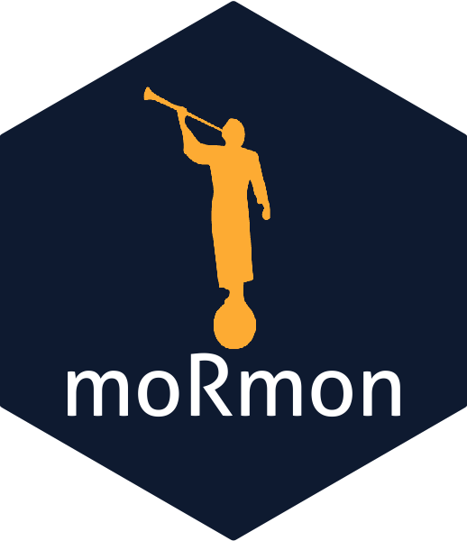

---
output:
  md_document:
    variant: markdown_github
---

<!-- README.md is generated from README.Rmd. Please edit that file -->

```{r, echo = FALSE}
knitr::opts_chunk$set(
  collapse = TRUE,
  comment = "#>",
  fig.path = "README-"
)
```

moRmon 
===================================================================

The goal of moRmon is to ...

## Example

This is a basic example which shows you how to solve a common problem:

```{r example}
## basic example code
```
